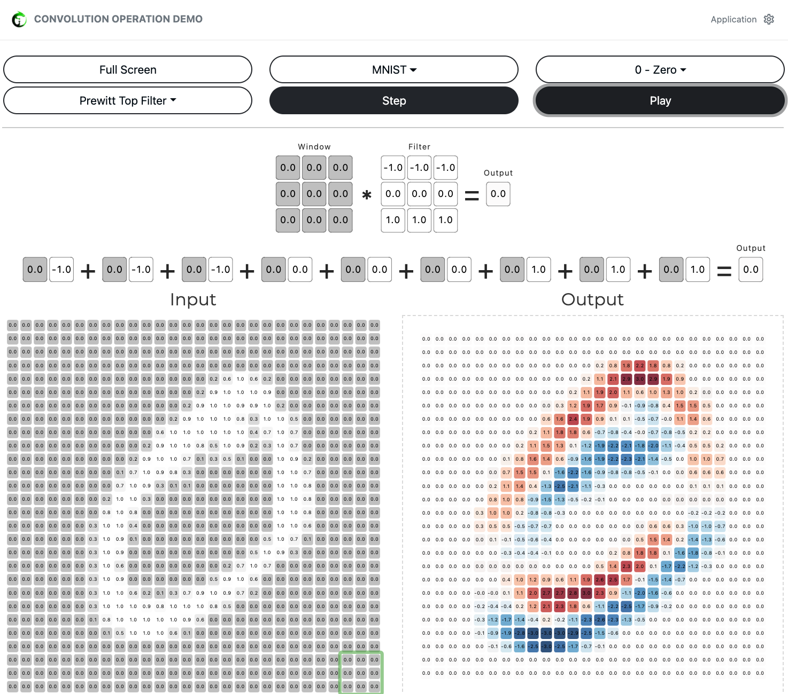
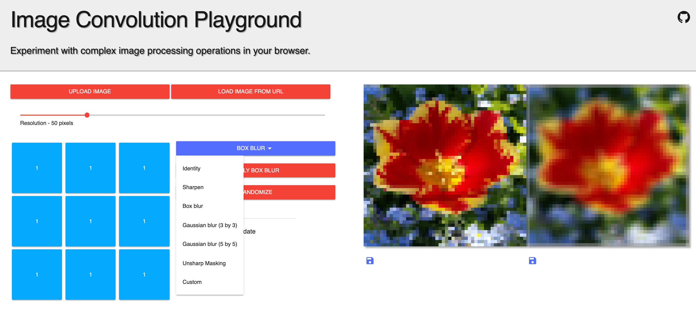
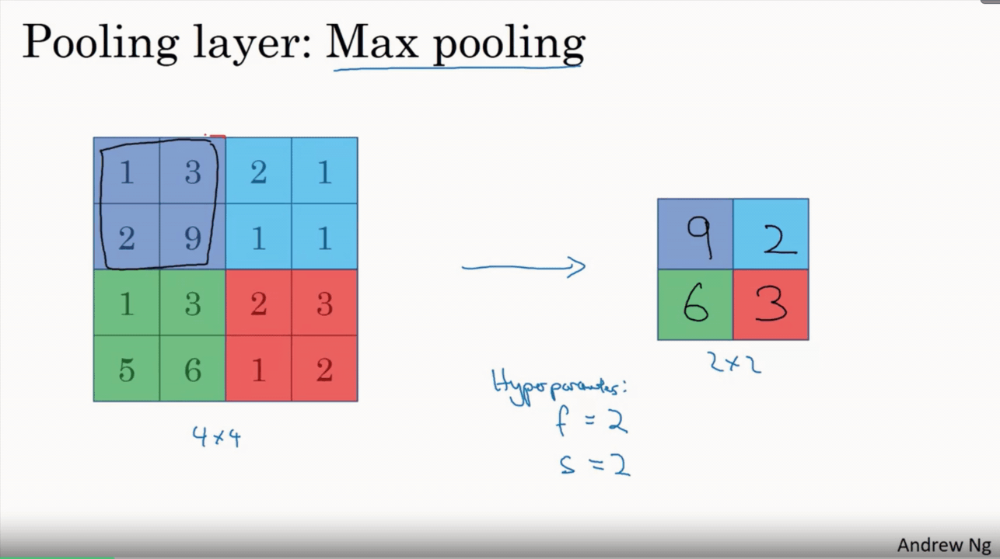
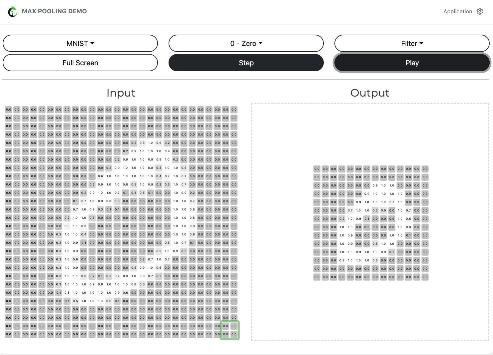

# Module 7: 人工智能神经网络基础-4 深度神经网络，卷积神经网络引入

- [Module 7: 人工智能神经网络基础-4 深度神经网络，卷积神经网络引入](#module-7-人工智能神经网络基础-4-深度神经网络卷积神经网络引入)
  - [1. 在`MNIST数据集`上 - 训练多层深度神经网络](#1-在mnist数据集上---训练多层深度神经网络)
    - [`dataset_visuals.py`](#dataset_visualspy)
    - [`mlp.py`](#mlppy)
  - [2. 卷积神经网络引入](#2-卷积神经网络引入)
    - [1. 图像卷积 (image convolution)](#1-图像卷积-image-convolution)
    - [2. 池化层 (pooling layer)](#2-池化层-pooling-layer)

*教学前需要装的python library*

```python
import torch
import numpy as np
from torchvision import datasets
import torchvision.transforms as transforms
import matplotlib.pyplot as plt
import torch.nn as nn
import torch.nn.functional as F
```


## 1. 在`MNIST数据集`上 - 训练多层深度神经网络

*建议教学时长：25分钟*

### [`dataset_visuals.py`](/Module7/dataset_visual.py)
- 简单介绍`MNIST手写数字数据集`的背景（在做任何数据分析前需要对于数据集的背景做一定的了解，有助于我们对于模型最终的结果有效性做出合理解释）
  - MNIST数据集是一个有名的手写数字数据集，在深度学习领域，手写数字识别是一个很经典的学习例子。
  - MNIST数据集是由0〜9手写数字图片和数字标签所组成的，由60000个训练样本和10000个测试样本组成，每个样本都是一张28 * 28像素的灰度手写数字图片。
  - 黑底白字。黑底用0表示，白字用0~1之间的浮点数表示，越接近1，颜色越百。
- 理解电脑中是如何存储图片数据 （用`dataset_visuals.py`来讲解）


<details>
  <summary>一张图片在计算机里的存储结构</summary>
  >>> images[0].shape

(1, 28, 28)

>>> images[0]
array([[[0.        , 0.        , 0.        , 0.        , 0.        ,
         0.        , 0.        , 0.        , 0.        , 0.        ,
         0.        , 0.        , 0.        , 0.        , 0.        ,
         0.        , 0.        , 0.        , 0.        , 0.        ,
         0.        , 0.        , 0.        , 0.        , 0.        ,
         0.        , 0.        , 0.        ],
          [0.        , 0.        , 0.        , 0.        , 0.        ,
         0.        , 0.        , 0.        , 0.        , 0.        ,
         0.        , 0.        , 0.        , 0.        , 0.        ,
         0.        , 0.        , 0.        , 0.        , 0.        ,
         0.        , 0.        , 0.        , 0.        , 0.        ,
         0.        , 0.        , 0.        ],
          [0.        , 0.        , 0.        , 0.        , 0.        ,
         0.        , 0.        , 0.        , 0.        , 0.        ,
         0.        , 0.        , 0.        , 0.        , 0.        ,
         0.        , 0.        , 0.        , 0.        , 0.        ,
         0.        , 0.        , 0.        , 0.        , 0.        ,
         0.        , 0.        , 0.        ],
          [0.        , 0.        , 0.        , 0.        , 0.        ,
         0.        , 0.        , 0.        , 0.        , 0.        ,
         0.        , 0.        , 0.        , 0.        , 0.        ,
         0.        , 0.        , 0.        , 0.        , 0.        ,
         0.        , 0.        , 0.        , 0.        , 0.        ,
         0.        , 0.        , 0.        ],
          [0.        , 0.        , 0.        , 0.        , 0.        ,
         0.        , 0.        , 0.        , 0.        , 0.        ,
         0.        , 0.        , 0.        , 0.        , 0.        ,
         0.        , 0.        , 0.        , 0.        , 0.        ,
         0.        , 0.        , 0.        , 0.        , 0.        ,
         0.        , 0.        , 0.        ],
          [0.        , 0.        , 0.        , 0.        , 0.        ,
         0.        , 0.        , 0.        , 0.        , 0.        ,
         0.        , 0.        , 0.01176471, 0.07058824, 0.07058824,
            0.07058824, 0.49411765, 0.53333336, 0.6862745 , 0.10196079,
            0.6509804 , 1.        , 0.96862745, 0.49803922, 0.        ,
         0.        , 0.        , 0.        ],
          [0.        , 0.        , 0.        , 0.        , 0.        ,
         0.        , 0.        , 0.        , 0.11764706, 0.14117648,
            0.36862746, 0.6039216 , 0.6666667 , 0.99215686, 0.99215686,
            0.99215686, 0.99215686, 0.99215686, 0.88235295, 0.6745098 ,
            0.99215686, 0.9490196 , 0.7647059 , 0.2509804 , 0.        ,
         0.        , 0.        , 0.        ],
          [0.        , 0.        , 0.        , 0.        , 0.        ,
         0.        , 0.        , 0.19215687, 0.93333334, 0.99215686,
            0.99215686, 0.99215686, 0.99215686, 0.99215686, 0.99215686,
            0.99215686, 0.99215686, 0.9843137 , 0.3647059 , 0.32156864,
            0.32156864, 0.21960784, 0.15294118, 0.        , 0.        ,
         0.        , 0.        , 0.        ],
          [0.        , 0.        , 0.        , 0.        , 0.        ,
         0.        , 0.        , 0.07058824, 0.85882354, 0.99215686,
            0.99215686, 0.99215686, 0.99215686, 0.99215686, 0.7764706 ,
            0.7137255 , 0.96862745, 0.94509804, 0.        , 0.        ,
         0.        , 0.        , 0.        , 0.        , 0.        ,
         0.        , 0.        , 0.        ],
          [0.        , 0.        , 0.        , 0.        , 0.        ,
         0.        , 0.        , 0.        , 0.3137255 , 0.6117647 ,
            0.41960785, 0.99215686, 0.99215686, 0.8039216 , 0.04313726,
         0.        , 0.16862746, 0.6039216 , 0.        , 0.        ,
         0.        , 0.        , 0.        , 0.        , 0.        ,
         0.        , 0.        , 0.        ],
          [0.        , 0.        , 0.        , 0.        , 0.        ,
         0.        , 0.        , 0.        , 0.        , 0.05490196,
            0.00392157, 0.6039216 , 0.99215686, 0.3529412 , 0.        ,
         0.        , 0.        , 0.        , 0.        , 0.        ,
         0.        , 0.        , 0.        , 0.        , 0.        ,
         0.        , 0.        , 0.        ],
          [0.        , 0.        , 0.        , 0.        , 0.        ,
         0.        , 0.        , 0.        , 0.        , 0.        ,
         0.        , 0.54509807, 0.99215686, 0.74509805, 0.00784314,
         0.        , 0.        , 0.        , 0.        , 0.        ,
         0.        , 0.        , 0.        , 0.        , 0.        ,
         0.        , 0.        , 0.        ],
          [0.        , 0.        , 0.        , 0.        , 0.        ,
         0.        , 0.        , 0.        , 0.        , 0.        ,
         0.        , 0.04313726, 0.74509805, 0.99215686, 0.27450982,
         0.        , 0.        , 0.        , 0.        , 0.        ,
         0.        , 0.        , 0.        , 0.        , 0.        ,
         0.        , 0.        , 0.        ],
          [0.        , 0.        , 0.        , 0.        , 0.        ,
         0.        , 0.        , 0.        , 0.        , 0.        ,
         0.        , 0.        , 0.13725491, 0.94509804, 0.88235295,
            0.627451  , 0.42352942, 0.00392157, 0.        , 0.        ,
         0.        , 0.        , 0.        , 0.        , 0.        ,
         0.        , 0.        , 0.        ],
          [0.        , 0.        , 0.        , 0.        , 0.        ,
         0.        , 0.        , 0.        , 0.        , 0.        ,
         0.        , 0.        , 0.        , 0.31764707, 0.9411765 ,
            0.99215686, 0.99215686, 0.46666667, 0.09803922, 0.        ,
         0.        , 0.        , 0.        , 0.        , 0.        ,
         0.        , 0.        , 0.        ],
          [0.        , 0.        , 0.        , 0.        , 0.        ,
         0.        , 0.        , 0.        , 0.        , 0.        ,
         0.        , 0.        , 0.        , 0.        , 0.1764706 ,
            0.7294118 , 0.99215686, 0.99215686, 0.5882353 , 0.10588235,
         0.        , 0.        , 0.        , 0.        , 0.        ,
         0.        , 0.        , 0.        ],
          [0.        , 0.        , 0.        , 0.        , 0.        ,
         0.        , 0.        , 0.        , 0.        , 0.        ,
         0.        , 0.        , 0.        , 0.        , 0.        ,
            0.0627451 , 0.3647059 , 0.9882353 , 0.99215686, 0.73333335,
         0.        , 0.        , 0.        , 0.        , 0.        ,
         0.        , 0.        , 0.        ],
          [0.        , 0.        , 0.        , 0.        , 0.        ,
         0.        , 0.        , 0.        , 0.        , 0.        ,
         0.        , 0.        , 0.        , 0.        , 0.        ,
         0.        , 0.        , 0.9764706 , 0.99215686, 0.9764706 ,
            0.2509804 , 0.        , 0.        , 0.        , 0.        ,
         0.        , 0.        , 0.        ],
          [0.        , 0.        , 0.        , 0.        , 0.        ,
         0.        , 0.        , 0.        , 0.        , 0.        ,
         0.        , 0.        , 0.        , 0.        , 0.18039216,
            0.50980395, 0.7176471 , 0.99215686, 0.99215686, 0.8117647 ,
            0.00784314, 0.        , 0.        , 0.        , 0.        ,
         0.        , 0.        , 0.        ],
          [0.        , 0.        , 0.        , 0.        , 0.        ,
         0.        , 0.        , 0.        , 0.        , 0.        ,
         0.        , 0.        , 0.15294118, 0.5803922 , 0.8980392 ,
            0.99215686, 0.99215686, 0.99215686, 0.98039216, 0.7137255 ,
         0.        , 0.        , 0.        , 0.        , 0.        ,
         0.        , 0.        , 0.        ],
          [0.        , 0.        , 0.        , 0.        , 0.        ,
         0.        , 0.        , 0.        , 0.        , 0.        ,
            0.09411765, 0.44705883, 0.8666667 , 0.99215686, 0.99215686,
            0.99215686, 0.99215686, 0.7882353 , 0.30588236, 0.        ,
         0.        , 0.        , 0.        , 0.        , 0.        ,
         0.        , 0.        , 0.        ],
          [0.        , 0.        , 0.        , 0.        , 0.        ,
         0.        , 0.        , 0.        , 0.09019608, 0.25882354,
            0.8352941 , 0.99215686, 0.99215686, 0.99215686, 0.99215686,
            0.7764706 , 0.31764707, 0.00784314, 0.        , 0.        ,
         0.        , 0.        , 0.        , 0.        , 0.        ,
         0.        , 0.        , 0.        ],
          [0.        , 0.        , 0.        , 0.        , 0.        ,
         0.        , 0.07058824, 0.67058825, 0.85882354, 0.99215686,
            0.99215686, 0.99215686, 0.99215686, 0.7647059 , 0.3137255 ,
            0.03529412, 0.        , 0.        , 0.        , 0.        ,
         0.        , 0.        , 0.        , 0.        , 0.        ,
         0.        , 0.        , 0.        ],
          [0.        , 0.        , 0.        , 0.        , 0.21568628,
            0.6745098 , 0.8862745 , 0.99215686, 0.99215686, 0.99215686,
            0.99215686, 0.95686275, 0.52156866, 0.04313726, 0.        ,
         0.        , 0.        , 0.        , 0.        , 0.        ,
         0.        , 0.        , 0.        , 0.        , 0.        ,
         0.        , 0.        , 0.        ],
          [0.        , 0.        , 0.        , 0.        , 0.53333336,
            0.99215686, 0.99215686, 0.99215686, 0.83137256, 0.5294118 ,
            0.5176471 , 0.0627451 , 0.        , 0.        , 0.        ,
         0.        , 0.        , 0.        , 0.        , 0.        ,
         0.        , 0.        , 0.        , 0.        , 0.        ,
         0.        , 0.        , 0.        ],
          [0.        , 0.        , 0.        , 0.        , 0.        ,
         0.        , 0.        , 0.        , 0.        , 0.        ,
         0.        , 0.        , 0.        , 0.        , 0.        ,
         0.        , 0.        , 0.        , 0.        , 0.        ,
         0.        , 0.        , 0.        , 0.        , 0.        ,
         0.        , 0.        , 0.        ],
          [0.        , 0.        , 0.        , 0.        , 0.        ,
         0.        , 0.        , 0.        , 0.        , 0.        ,
         0.        , 0.        , 0.        , 0.        , 0.        ,
         0.        , 0.        , 0.        , 0.        , 0.        ,
         0.        , 0.        , 0.        , 0.        , 0.        ,
         0.        , 0.        , 0.        ],
          [0.        , 0.        , 0.        , 0.        , 0.        ,
         0.        , 0.        , 0.        , 0.        , 0.        ,
         0.        , 0.        , 0.        , 0.        , 0.        ,
         0.        , 0.        , 0.        , 0.        , 0.        ,
         0.        , 0.        , 0.        , 0.        , 0.        ,
         0.        , 0.        , 0.        ]]], dtype=float32)
</details>


### [`mlp.py`](/Module7/mlp.py)

- 比较浅层Perceptron和多层深度神经网络在`MNIST手写数据集`上的正确率表现（在我的本地电脑上：Perception overall accuracy 92%， MLP overall accuracy 97 ~ 98%）
  - Perceptron基本上在2分钟内可以跑完，MLP大概在5～6分钟左右
  
```
Perceptron(
  (fc1): Linear(in_features=784, out_features=10, bias=True)
)
Epoch: 1        Training Loss: 0.674300
Epoch: 2        Training Loss: 0.408527
Epoch: 3        Training Loss: 0.367693
Epoch: 4        Training Loss: 0.346877
Epoch: 5        Training Loss: 0.333568
Epoch: 6        Training Loss: 0.324056
Epoch: 7        Training Loss: 0.316800
Epoch: 8        Training Loss: 0.311018
Epoch: 9        Training Loss: 0.306258
Epoch: 10       Training Loss: 0.302245
Epoch: 11       Training Loss: 0.298788
Epoch: 12       Training Loss: 0.295773
Epoch: 13       Training Loss: 0.293103
Epoch: 14       Training Loss: 0.290719
Epoch: 15       Training Loss: 0.288564
Epoch: 16       Training Loss: 0.286605
Epoch: 17       Training Loss: 0.284806
Epoch: 18       Training Loss: 0.283145
Epoch: 19       Training Loss: 0.281611
Epoch: 20       Training Loss: 0.280177
Test Loss: 0.277265

Test Accuracy of     0: 98% (963/980)
Test Accuracy of     1: 97% (1108/1135)
Test Accuracy of     2: 88% (913/1032)
Test Accuracy of     3: 90% (917/1010)
Test Accuracy of     4: 92% (911/982)
Test Accuracy of     5: 87% (777/892)
Test Accuracy of     6: 95% (911/958)
Test Accuracy of     7: 91% (942/1028)
Test Accuracy of     8: 88% (864/974)
Test Accuracy of     9: 90% (915/1009)

Test Accuracy (Overall): 92% (9221/10000)
```


```
MLP(
  (fc1): Linear(in_features=784, out_features=512, bias=True)
  (fc2): Linear(in_features=512, out_features=512, bias=True)
  (fc3): Linear(in_features=512, out_features=10, bias=True)
)
Epoch: 1        Training Loss: 0.786223
Epoch: 2        Training Loss: 0.299194
Epoch: 3        Training Loss: 0.237961
Epoch: 4        Training Loss: 0.196748
Epoch: 5        Training Loss: 0.165963
Epoch: 6        Training Loss: 0.142040
Epoch: 7        Training Loss: 0.123203
Epoch: 8        Training Loss: 0.107992
Epoch: 9        Training Loss: 0.095503
Epoch: 10       Training Loss: 0.085099
Epoch: 11       Training Loss: 0.076297
Epoch: 12       Training Loss: 0.068748
Epoch: 13       Training Loss: 0.062256
Epoch: 14       Training Loss: 0.056566
Epoch: 15       Training Loss: 0.051538
Epoch: 16       Training Loss: 0.047088
Epoch: 17       Training Loss: 0.043092
Epoch: 18       Training Loss: 0.039477
Epoch: 19       Training Loss: 0.036197
Epoch: 20       Training Loss: 0.033190
Test Loss: 0.068800

Test Accuracy of     0: 98% (969/980)
Test Accuracy of     1: 99% (1128/1135)
Test Accuracy of     2: 97% (1006/1032)
Test Accuracy of     3: 98% (990/1010)
Test Accuracy of     4: 98% (963/982)
Test Accuracy of     5: 98% (879/892)
Test Accuracy of     6: 96% (927/958)
Test Accuracy of     7: 96% (996/1028)
Test Accuracy of     8: 96% (943/974)
Test Accuracy of     9: 97% (984/1009)

Test Accuracy (Overall): 97% (9785/10000)
```


## 2. 卷积神经网络引入

*建议教学时长：15分钟*


- 理解为什么需要卷积网络
  - 之前的全连接(fully-connected layer)将图片转换为很长很长的向量，（比如28 * 28像素的图片转换成长度为784的向量）
    
  - 对于人来说这两张非常相似，但如果问电脑以下两张图片有什么不同，答案是截然不同的，因为每个像素点的坐标都是不一样的。
    
  - 卷积网络可以简单理解为将像素点的邻近像素点的信息也考虑进去，不是像素级的比较，而是部分图片和部分图片的比较

### 1. 图像卷积 (image convolution)
- 从box blurring开始讲，在黑板上做一个演示
- 图像卷积就是卷积核在图像上按行滑动遍历像素时不断的相乘求和的过程
    
    #### Image Convolution Calculation Demo:
    https://deeplizard.com/resource/pavq7noze2
    
    #### 图像卷积效果Demo (网页里有不同kernel，比如图片模糊，图片锐化等可以让同学用不同的卷积核看看应用在图片上的效果):
    https://generic-github-user.github.io/Image-Convolution-Playground/src/
    

### 2. 池化层 (pooling layer)
- 用于压缩数据和参数的量
  
    #### Pooling Layer Demo:
    https://deeplizard.com/resource/pavq7noze3
    


下节课预告：人工智能神经网络进阶-1 卷积神经网络结构，训练卷积神经网络