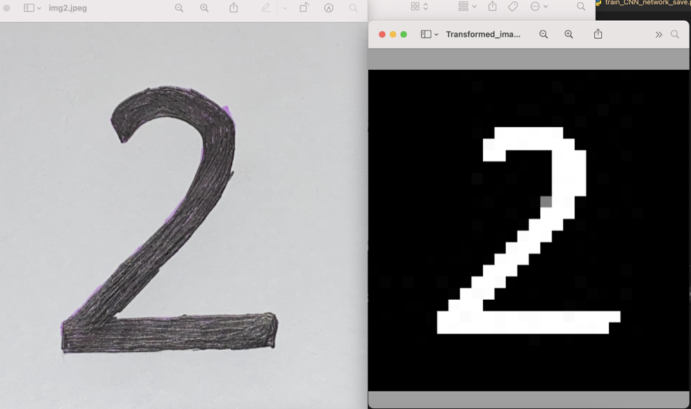
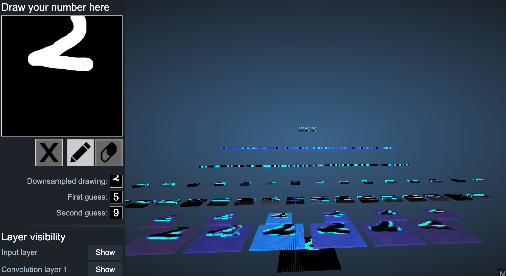
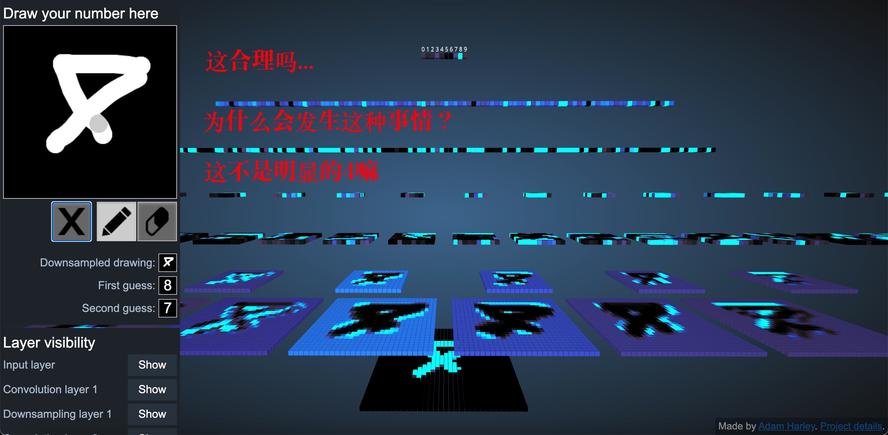

# 运用卷积神经网络，`bad case`分析，图像增广引入

- [运用卷积神经网络，`bad case`分析，图像增广引入](#运用卷积神经网络bad-case分析图像增广引入)
  - [1. 运用卷积神经网络，分类同学自己的手写数字图片](#1-运用卷积神经网络分类同学自己的手写数字图片)
    - [`one-image-preprocess`](#one-image-preprocess)
    - [`all-images-preprocess`](#all-images-preprocess)
    - [`train+save_model`](#trainsave_model)
    - [`load_test_cnn`](#load_test_cnn)
  - [2. 使用手写数字可视化来看看网络对于哪些数字的分类效果不佳 - `bad case`分析](#2-使用手写数字可视化来看看网络对于哪些数字的分类效果不佳---bad-case分析)
  - [3. 图像增广引入](#3-图像增广引入)

## 1. 运用卷积神经网络，分类同学自己的手写数字图片

*建议教学时长：25分钟*

### [`one-image-preprocess`](/Module9/img_preprocess.py)

NOTE: 拍照的时候需要用比较粗一点的记号黑笔，白纸，开闪光灯的拍，尽量提高黑字和白底的光线和颜色差
- 用opencv对于一张手写数字图片进行transformation


### [`all-images-preprocess`](/Module9/all_img_preprocess.py)
- 批量化处理，将`img_preprocess.py`对于整一个文件夹的img（原始图片）做处理

### [`train+save_model`](/Module9/train_CNN_network_save.py)
`model/cnn.pth`
### [`load_test_cnn`](/Module9/load_test_cnn_model.py)


```python
# 分类结果：
Transformed_image0.jpg 4
Transformed_image1.jpg 8
Transformed_image2.jpg 9
Transformed_image3.jpg 5
Transformed_image4.jpg 2
Transformed_image5.jpg 3
Transformed_image6.jpg 0
Transformed_image7.jpg 1
Transformed_image8.jpg 6
Transformed_image9.jpg 7
```
## 2. 使用手写数字可视化来看看网络对于哪些数字的分类效果不佳 - `bad case`分析

*建议教学时长：10分钟*

可以让同学们借助可视化来分析一下哪些数字容易被分类错误：https://www.cs.ryerson.ca/~aharley/vis/conv/
让同学们尝试并且，分类出来容易分类错的数字特征：
Hint: 
1. 数字在框框里的位置不是中心，而是靠近边缘
2. 数字在框框里有一些旋转
3. 数字在框框里的大小（太大或者太小）
4. 数字在框框里不完整（部分数字出现在框框中）
  
引导同学们想想如何解决这种问题，能让分类模型在现实生活中效果更佳鲁棒 
- （可能有些同学会说对这种图像做修正，比如如果图像旋转了30度，就把它旋转回来。但是现实情况下情况复杂的多，我们需要从训练数据集上做些操作，使得模型在现实场景下有更强的泛化性）
- 用`图像增广` （看第3部分）


- 正常

- 数字相较于整个框框太小了

- 数字接近于框框边缘，不在中心位置

- 部分数字在框框当中

- 手写数字存在一定角度的旋转

## 3. 图像增广引入

*建议教学时长：10分钟*

图像增广在对训练图像进行一系列的随机变化之后，生成相似但不同的训练样本，从而扩大了训练集的规模。 此外，应用图像增广的原因是，随机改变训练样本可以减少模型对某些属性的依赖，从而提高模型的泛化能力。 例如，我们可以以不同的方式裁剪图像，使感兴趣的对象出现在不同的位置，减少模型对于对象出现位置的依赖。 我们还可以调整亮度、颜色等因素来降低模型对颜色的敏感度。


